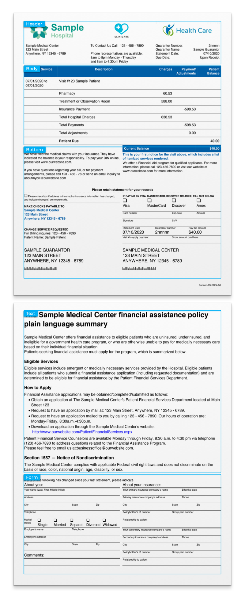
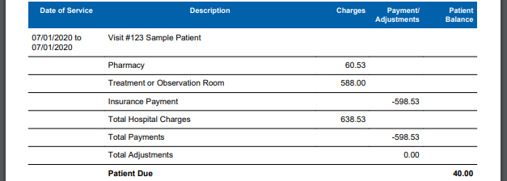
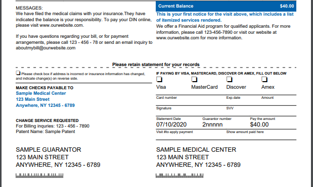
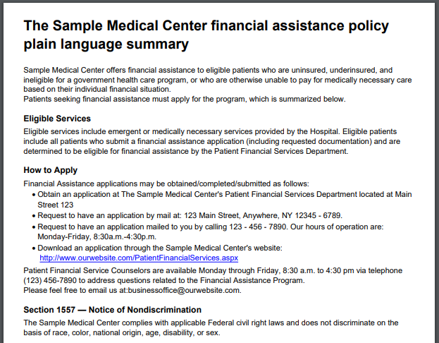
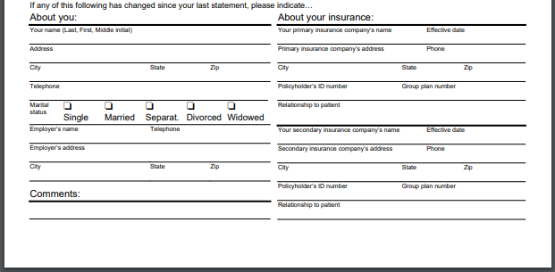

##### Example: MedicalBill

**MedicalBill** project is an example of creating a **“Medical Bill”** document. The example shows how to create a complex document that includes tables, nested tables and lists. Also it shows one of the ways to display forms for manually filling a printed document.

The example source is available in [PDF.Flow.Examples repository](https://github.com/gehtsoft-usa/PDF.Flow.Examples/tree/master/Examples/MedicalBill).


**Table of Contents**  

- [Prerequisites](#prerequisites)
- [Purpose](#purpose)
- [Description](#description)
- [Output file](#output-file)
- [Open the project in Visual Studio](#1-open-the-project-in-visual-studio)
- [Run the sample application](#2-run-the-sample-application)
- [Source code structure](#3-source-code-structure)
- [Class Program](#4-class-program)
- [The MedicalBillRunner class](#5-the-medicalbillrunner-class)
- [The MedicalBillBuilder class](#6-the-medicalbillbuilder-class)
- [The MedicalBillFrontBuilder class](#7-the-medicalbillfrontbuilder-class)
- [The MedicalBillBackBuilder class](#8the-medicalbillbackbuilder-class)
- [The MedicalBillHeadBuilder class](#9-the-medicalbillheadbuilder-class)
- [The MedicalBillBodyBuilder class](#10-the-medicalbillbodybuilder-class)
- [The MedicalBillBottomBuilder class](#11-the-medicalbillbottombuilder-class)
- [The MedicalBillBackTextBuilder class](#12-the-medicalbillbacktextbuilder-class)
- [The MedicalBillBackClientInfoBuilder class](#13-the-medicalbillbackclientinfobuilder-class)
- [Summary](#summary)

# Prerequisites
1) **Visual Studio 2017** or above is installed.
To install a community version of Visual Studio use the following link: https://visualstudio.microsoft.com/vs/community/
Please make sure that the way you are going to use Visual Studio is allowed by the community license. You may need to buy Standard or Professional Edition.

2) **.NET Core Framework SDK 2.1** or above is installed.
To install the framework use the following link: https://dotnet.microsoft.com/download

# Purpose
The example shows how to create a “Medical Bill” that is a complex two-page document. See Fig. 1.

Images below show the main blocks of the document highlighted in with brown rectangles.

The first, or the front page is the bill itself that consists of:
* Header
* Bill data table (Body)
* Bottom

The second, or the back page is a form for the client to fill in the information about himself and his insurance agent. The page consists of: 

* Text
* Form



Fig. 1

# Description

#### Output file
The example creates the **Medical.pdf** file in the output **bin/(debug|release)/netcoreapp2.1** folder, unless specified otherwise in the command line.

#### 1. Open the project in Visual Studio
There are 2 ways to open the project:

1. After installing Visual Studio, you just need to double click on the project file of the MedicalBill.csproj.

2. From inside Visual Studio:
* Run Visual Studio
* File -> Open -> Project/Solution -> Choose the MedicalBill.csproj 

#### 2. Run the sample application
* Running from Visual Studio:

Click on F5.

* Running from the command line:

In the directory with the MedicalBill.csproj, run the command: 

```
dotnet run
```

You can get optional parameters of the command line using the command:

```
dotnet run -help
```

that shows specification of the command line options:

```
Usage: dotnet run [fullPathToOutFile] [appToView]
Where: fullPathToOutFile - a path to the result file, 'MedicalBill.pdf' by default
appToView - the name of an application to view the file immediately after preparing, by default none app starts
```

## 3. Source code structure

The source code consists of several files (classes).

The reasons to write several classes are the following (in descending order of priority):

* Separation of responsibility. Class Program processes the command line options, any possible errors during the document creation, and displays the error report. The rest of the classes do not process the command line options and errors. They are used  to build the document itself.
* Reduction of responsibility of each class. This helps to limit the size of code for each class that improves  understanding of the code example.
* The document consists of several content blocks which are independent, so for each class you can select its own block.

## 4. Class Program
Responsibility:
* Parse command line options.
You can process the command line options using the **PrepareParameters** that prepares the **Parameters** structure.
* Display prompts to user when one of the following options is presented on the command line: “?”, “-h”, “-help”, “--h”, “--help”. It is proccesed by the  **Usage**
* Build document. It delegates the document building to the **MedicalBillRunner** class with the name of the resulting document file.
* Run the application to demonstrate the resulting document if specified in the command line options.

## 5. The MedicalBillRunner class
Responsibility:
* Creat the object of the **MedicalBillBuilder** class.
* Initialize  its properties with data of the Medical Bill. The properties of the MedicalBillBuilder class have the default values, which are the same as those set on the lines:

```csharp
                GuarantorNumber = "2nnnnn",
                StatementDate = "07/10/2020",
                CenterName = "Sample Medical Center",
                CenterAddress = "123 Main Street\nAnywhere, NY 12345 - 6789",
                CenterPhone = "123 - 456 - 7890",
                CenterPatent = "Sample Patent",
                FinServAddress = "Main Street 123",
                FinServUrl = "http://www.ourwebsite.com/PatientFinancialServices.aspx"
```

These lines are not needed to run the sample application. 
But these lines and subsequent lines must contain real information about the medical entity and data of account calculations in the real application.

* Build the document. It delegates the document building to the **MedicalBillBuilder** class using the **CreateDocumentBuilder** method

## 6. The MedicalBillBuilder class
Responsibility:
* Save the properties with data of the medical entity in the **Params** structure.  Classes for creating the document blocks will use this structure. 
* Save the calculation data in the **RowData** structure. A class for creating the callculation block will use this structure.

The **CreateDocumentBuilder** performs the responsibilities to:

* Create an object of the **Gehtsoft.PDFFlow.Builder.DocumentBuilder** class
* Create an object of the **MedicalBillFrontBuilder** class and build the front page using the **Build** method of the created object.
* Create an object of the **MedicalBillBackBuilder** class and build the back page using the **Build** method of the created object
* Return the created object of the **Gehtsoft.PDFFlow.Builder.DocumentBuilder** class

## 7. The MedicalBillFrontBuilder class
Responsibility:
* Create a page and set its parameters

```csharp
            var sectionBuilder = documentBuilder.AddSection();
            sectionBuilder
                .SetOrientation(Orientation)
                .SetMargins(Margins)            
```
* Create the footer: 

```csharp
                .AddFooterToOddPage(12, BuildFooter);
```
* Create the first (front) page of the document.
This responsibility is performed by the Build method. It creates the objects in order and runs the Build methods for the following classes:


* **MedicalBillHeadBuilder**
* **MedicalBillBodyBuilder**
* **MedicalBillBottomBuilder**


The footer is created by the **BuildFooter** method. The link to the method is passed to the **Gehtsoft.PDFFlow.Builder.SectionBuilder.AddFooterToOddPage** method. 

```csharp
        private void BuildFooter(RepeatingAreaBuilder footerBuilder)
        {
            var paragraphBuilder = footerBuilder.AddParagraph();
            paragraphBuilder
                .SetAlignment(HorizontalAlignment.Right)
                .SetFont(FNT7)
                .AddTextToParagraph("1nnnnn-XX-XXX-00");
        }
```

## 8.The MedicalBillBackBuilder class

Responsibility:
* Create the page and sets its parameters

```csharp
            var sectionBuilder = documentBuilder.AddSection();
            sectionBuilder.SetOrientation(Orientation).SetMargins(Margins);
```
* Create the second (back) page of the document.
This responsibility is performed by the Build method. It creates the objects in order and runs the Build methods for the following classes:


* **MedicalBillBackTextBuilder**
* **MedicalBillBackClientInfoBuilder**

## 9. The **MedicalBillHeadBuilder** class

Responsibility:
* Create the Header of the page. See. Fig. 2.


Fig. 2

The responsibility is performed by the **BuildHead** method.

The Header consists of 3 logos of the medical center in the top row and 4 blocks of text information in the bottom row. 
In this case, the 2 right blocks of text information are located under one picture of the top row. 
Therefore, this part of the document is made in the form of a table consisting of 2 rows with 4 cells, where the last cell of the first row is set to be extended into 2 columns.

Although the PDFFlow library supports installing the header to the **Gehtsoft.PDFFlow.Builder.Gehtsoft.PDFFlow.Builder.AddHeader ... **, the using this method does not give any advantage in this particular case. Therefore, the table can be inserted directly into the section.

```csharp
            var tableBuilder = sectionBuilder.AddTable();
            tableBuilder
                .SetContentRowStyleFont(FNT9)
                .SetBorder(Stroke.None)
                .SetWidth(XUnit.FromPercent(100))
                .AddColumnPercentToTable("", 33)
                .AddColumnPercentToTable("", 33)
                .AddColumnPercentToTable("", 17)
                .AddColumnPercent("", 17);
```
The cells with pictures are inserted into the first row of the table, created as follows 
```csharp
            var rowBuilder = tableBuilder.AddRow();
```
Expansion of the cell by 2 columns is performed using the **TableCellBuilder.SetColSpan** method.
```csharp
            cellBuilder = rowBuilder.AddCell();
            cellBuilder.SetColSpan(2).SetPadding(4, 0, 0, 0);
            paragraphBuilder = cellBuilder.AddParagraph();
            paragraphBuilder
                .AddInlineImage(Path.Combine(ps.ImageDir, "Healthcare_2x.png"))
                .SetAlignment(HorizontalAlignment.Right);
```
The cells with texts are inserted in the second row of the table.
```csharp
            rowBuilder = tableBuilder.AddRow();
            cellBuilder = rowBuilder.AddCell();
            cellBuilder
                .SetPadding(4)
                .AddParagraphToCell(ps.CenterName + "\n" + 
                    ps.CenterAddress);
            cellBuilder = rowBuilder.AddCell();
            cellBuilder
                .SetPadding(4)
                .AddParagraphToCell("To Contact Us Call:  " + 
                    ps.CenterPhone + 
                    "\n\nPhone representatives are available:\n8am to 8pm Monday - Thursday\nand 8am to 4:30pm Friday");
etc.
```
## 10. The MedicalBillBodyBuilder class

Responsibility:
* Create the table of the Medicall Bil calculationl. See. Fig. 3


Fig. 3

The responsibility is performed by the **BuildBody** method

It is implemented as a  table with 5 columns:

```csharp
            var tableBuilder = sectionBuilder.AddTable();
            tableBuilder
                .SetWidth(XUnit.FromPercent(100))
                .SetBorder(Stroke.None)
                .AddColumnPercentToTable("", 17)
                .AddColumnPercentToTable("", 47)
                .AddColumnPercentToTable("", 12)
                .AddColumnPercentToTable("", 12)
                .AddColumnPercent("", 12);
```

The first row is created with a blue background. 

```csharp
            var rowBuilder = tableBuilder.AddRow();
            rowBuilder
                .SetBackColor(BLUE_COLOR)
```
This row sets the titles, for example
```csharp
            var cellBuilder = rowBuilder.AddCell();
            cellBuilder
                .SetPadding(4)
                .AddParagraphToCell("Date of Service");
etc.
```
The rows with calculation data are displayed in the **foreach**.
```csharp
            foreach (RowData rowData in rowsData)
            {
                FontBuilder curFont = (--i) == 0 ? FNT10B : FNT10;
                rowBuilder = tableBuilder.AddRow();
                rowBuilder
                    .SetFont(curFont)
                    .SetBorder(BorderBuilder.New()
                        .SetRightWidth(0)
                        .SetTopWidth(0)
                        .SetLeftWidth(0)
                        .SetBottomWidth(0.5f)
                        .SetBottomStroke(Stroke.Solid)
                    );
                cellBuilder = rowBuilder.AddCell();
                cellBuilder
                    .SetPadding(4)
                    .AddParagraphToCell(rowData.Date);
etc.
```
## 11. The MedicalBillBottomBuilder class

Responsibility:
* Create the bottom part of the Medicall Bill. See. Fig. 4


Fig. 4

The responsibility is performed by the **BuildBottom** method.

The bottom part of the Medicall Bill consists of the following blocks:
* The block before the **Cut**
* The **Cut**
* The block after the **Cut**

The **Cut** is a horizontal dashed line with the text in front of it.

Creation of these blocks is performed in the methods, respectively:
* The **BuildBeforeCut**
* The **BuildCut**
* The **BuildAfterCut**


###### The BuildBeforeCut method

There are 2 columns before the **Cut** on the document. Therefore, the block before the **Cut** is implemented as a one-row table with 2 columns of the same width. 

* The left column with the text "*MESSAGES: ...*"
* The right column with the table "*Current Ballance ...*"
```csharp
        private void BuildBeforeCut(SectionBuilder sectionBuilder)
        {
            var outerTableBuilder = sectionBuilder.AddTable();
            outerTableBuilder
                .SetWidth(XUnit.FromPercent(100)).SetBorder(Stroke.None)
                .AddColumnPercentToTable("", 50)
                .AddColumnPercent("", 50);
            var rowBuilder = outerTableBuilder.AddRow();
            var cellBuilder = rowBuilder.AddCell();
            cellBuilder
                .SetFont(FNT9).SetPadding(0, 8, 0, 0)
                .AddParagraphToCell("MESSAGES:\nWe have filed the medical claims with your insurance.They have\nindicated the balance is your responsibility. To pay your DIN online,\nplease visit www.ourwebsite.com.\n\nIf you have questions regarding your bill, or for payment arrangements, please call 123 - 456 - 78 or send an email inquiry to aboutmybill@ourwebsite.com");
            cellBuilder = rowBuilder.AddCell();
            cellBuilder.AddTable(FillBottomBalanceTable);
        }
```
The **FillBottomBalanceTable** method fills the  "*Current Ballance ...*" table. The link to the method is passed to the **Gehtsoft.PDFFlow.Builder.TableCellBuilder.AddTable** method.
The FillBottomBalanceTable method creates a table with 2 columns. Only the first row of the table is divided into 2 cells, the cells of the second and third rows occupy 2 columns. This is set using the ** Gehtsoft.PDFFlow.Builder.TableCellBuilder.SetColSpan (2) ** method.

```csharp
        private void FillBottomBalanceTable(TableBuilder tableBuilder)
        {
            tableBuilder
                .SetWidth(XUnit.FromPercent(100)).SetBorder(Stroke.None)
                .SetContentRowBorderWidth(0, 0, 0, 0)
                .AddColumnPercentToTable("", 74)
                .AddColumnPercent("", 26);
            var rowBuilder = tableBuilder.AddRow();
            var cellBuilder = rowBuilder.AddCell();
            cellBuilder
                .SetPadding(4)
                .SetBackColor(MedicalBillBuilder.BLUE_COLOR)
                .SetFont(FNT9B_W)
                .AddParagraphToCell("Current Balance");
            cellBuilder = rowBuilder.AddCell();
            cellBuilder
                    .SetPadding(4)
                    .SetHorizontalAlignment(HorizontalAlignment.Right)
                    .SetBackColor(MedicalBillBuilder.BLUE_COLOR)
                    .SetFont(FNT9B_W)
                    .AddParagraphToCell(ps.Balance);
            rowBuilder = tableBuilder.AddRow();
            cellBuilder = rowBuilder.AddCell();
            cellBuilder
                .SetColSpan(2)
                .SetFont(FNT9B_B)
                .AddParagraphToCell("This is your first notice for the visit above, which includes a list of itemized services rendered.");
            rowBuilder = tableBuilder.AddRow();
            cellBuilder = rowBuilder.AddCell();
            cellBuilder
                .SetColSpan(2)
                .SetFont(FNT9)
                .AddParagraphToCell("We offer a Financial Aid program for qualified applicants. For more information, please call 123-456-7890 or visit our website at www.ourwebsite.com for more information.");
        }
    }
```
###### The BuildCut method

The **Cut** is a horizontal dashed line with the text in front of it. 
```csharp
        private void BuildCut(SectionBuilder sectionBuilder)
        {
            var paragraphBuilder = sectionBuilder.AddParagraph();
            paragraphBuilder
                .SetAlignment(HorizontalAlignment.Center)
                .SetFont(FNT9B).SetMarginTop(20)
                .AddTextToParagraph("Please retain statement for your records");
            sectionBuilder.AddLine(PageWidth, 0.5f, Stroke.Dashed);
        }
```

###### The BuildAfterCut method

The block after the **Cut** is divided into 2 parts vertically

* The information about the two payment methods of the Medical Bill must be at the top.
* The information on how to send the Medical Bill by mail must be at the bottom. 

Accordingly, these parts are created by the **BuildPayment** and the **BuildPostNet** methods. 


###### The BuildPayment method

The method creates a block with the information about the two payment methods of the Medical Bill:

* Payment by check. The information about the payment must be located on the left.
* Payment by credit card. The information about the payment is a form for the credit card data located on the right. This form is expected to be filled manually by the patient on the printed document.

The table is created with one row and two columns for this:
```csharp
        private void BuildPayment(SectionBuilder sectionBuilder)
        {
            var tableBuilder = sectionBuilder.AddTable();
            tableBuilder
                .SetWidth(XUnit.FromPercent(100)).SetBorder(Stroke.None)
                .AddColumnPercentToTable("", 50)
                .AddColumnPercent("", 50);
            var rowBuilder = tableBuilder.AddRow();
            rowBuilder
                .AddCellToRow(BuildCheck)
                .AddCellToRow(BuilCard);
        }
```

The **BuildCheck** and **BuilCard** methods create information about two payment methods.

###### The BuildCheck method

The method creates information about the payment by check in the document.
In order to display a line before the phrase "MAKE CHECKS PAYABLE TO", a solution to create the table with a visible bottom Border in the first row was chosen.
The method creates a table and delegates its filling to the **FillCheckTable** method.


###### The FillCheckTable method

The method fills the table with information for the payment by check and sets the visible bottom Border in the first row:

```csharp
            tableBuilder.SetWidth(PageWidth / 2 - 8).SetBorder(Stroke.None)
                .AddColumnPercent("", 100);
            var rowBuilder = tableBuilder.AddRow();
            rowBuilder.SetBorder(BorderBuilder.New()
                .SetRightWidth(0)
                .SetTopWidth(0)
                .SetLeftWidth(0)
                .SetBottomWidth(0.5f)
                .SetBottomStroke(Stroke.Solid)
            );
```
###### The  BuildCard method

The method creates information for the payment by credit card.
The information consists of 

* a form for choosing card types;
* a form with 4 rows for filling credit card details.

```csharp
        private void BuilCard(TableCellBuilder cellBuilder)
        {
            if (ps.CardNames.Count > 0)
            {
                AddCardHead(cellBuilder);
                AddForm(cellBuilder, MedicalBillBuilder.CARD_TEXTS1, 
                    new int[] { 50, 25, 25 });
                AddForm(cellBuilder, MedicalBillBuilder.CARD_TEXTS2, new int[] { 50, 50 });
                AddForm(cellBuilder, MedicalBillBuilder.CARD_TEXTS3, 
                    new int[] { 33, 34, 33 }, false, 
                    new string[] { ps.StatementDate, ps.GuarantorNumber, ps.Balance });
                AddForm(cellBuilder, MedicalBillBuilder.CARD_TEXTS4, 
                    new int[] { 50, 50 }, true);
            }
        }
```

###### The  AddCardHead method

The method creates the form for choosing card types.
It creates the paragraph with the phrase "* IF PAYING BY VISA, MASTERCARD, DISCOVER OR AMEX, FILL OUT BELOW *".
It creates the table for the chekboxes of each card type.
It delegates the filling of the table to the **FillCardNames** method.


###### The FillCardNames method

The method in the **foreach** of the **CardNames** creates columns for each card type and fills the cells with the checkbox and the name of the card type in such **foreach**.
```csharp
        private void FillCardNames(TableBuilder tableBuilder)
        {
            tableBuilder
                .SetWidth(XUnit.FromPercent(100))
                .SetBorder(Stroke.None)
                .SetContentRowBorderWidth(0, 0, 0, 0);
            foreach (string cardName in ps.CardNames)
            {
                tableBuilder
                    .AddColumnPercent("", 100 / ps.CardNames.Count);
            };
            var rowBuilder = tableBuilder.AddRow();
            foreach (string cardName in ps.CardNames)
            {
                var cellBuilder = rowBuilder.AddCell().SetPadding(0, 0, 0, 8);
                cellBuilder.AddParagraph("o").SetFont(FNTZ16);
                cellBuilder.AddParagraph(cardName).SetFont(FNT10);
            }
        }
```

###### The FormBuilder.AddForm method

This method is defined in the **FormBuilder** class and is used to create forms on both the front and back pages.

The method takes the parameters: 
* The **cellBuilder** — an object of the **Gehtsoft.PDFFlow.Builder.TableCellBuilder** class of the table cell where you want to create the form. 
* The **labels** — a **string** array, which must be printed as a label of the field value.
* The **widths** — a **int** array. Each element of the array determines the width of the column in % of the width of the nested table to display a label and empty space for the field value 
* The **bottomBorder** — an optional **bool** flag value. It determines whether to print the bottom Border of the row. The default value is **false**
* The **values** — an optional **string** array of field values. If it is specified and not null, values are printed instead of blank space. It is used to display the string "* Statement Date ...*"
* The **topBorderDepth** — an optional thickness, **float**, of the top border of the line. The default value is ** 0.5 **
* The **bottomBorderDepth** — an optional thickness, **float**, of the bottom border of the line. The default value is **0.5**
The * **valueFontSize** — an optional font size, **float**, for printing elements of the **values** array. The default value is **12**

The method creates a nested table with one row of cells. Each cell contains
* the label of the field
* a space to be filled by the client


###### The BuildPostNet method

The method creates information about sending the Medical Bill by mail.

This information represents 2 identical blocks at the very bottom of the front page, starting with the strings"* SAMPLE GUARANTOR *" and "*SAMPLE MEDICAL CENTER*". Therefore, it is created by a table with one row and two columns.

```csharp
        private void BuildPostNet(SectionBuilder sectionBuilder)
        {
            var tableBuilder = sectionBuilder.AddTable();
            tableBuilder
                .SetWidth(XUnit.FromPercent(100)).SetBorder(Stroke.None)
                .AddColumnPercentToTable("", 50)
                .AddColumnPercent("", 50);
            var rowBuilder = tableBuilder.AddRow();
            var cellBuilder = rowBuilder.AddCell().SetFont(FNT12);
            var paragraphBuilder = cellBuilder.AddParagraph((ps.GuarantorName + "\n" +
                    ps.CenterAddress).ToUpper());
            paragraphBuilder.SetMarginTop(10).SetMarginBottom(10);
            cellBuilder.AddImageToCell(Path.Combine(ps.ImageDir,
                    "postnet1_2x.png"), new XSize(124, 11));
            cellBuilder = rowBuilder.AddCell().SetFont(FNT12);
            paragraphBuilder = cellBuilder.AddParagraph((ps.CenterName + "\n" +
                    ps.CenterAddress).ToUpper());
            paragraphBuilder.SetMarginTop(10).SetMarginBottom(10);
            cellBuilder.AddImageToCell(Path.Combine(ps.ImageDir,
                    "postnet2_2x.png"), new XSize(124, 11));
        }

```

## 12. The **MedicalBillBackTextBuilder** class

Responsibility: Create the block of text on the second (the back) page of the document


Fig. 5. 

This responsibility is performed by the **AddTexts** method.

###### The AddTexts method

The method creates the text information on the second (the back) page of the document.

The information consists of several distinct blocks of text:
* The first block with the title format is different from the other blocks "* The Sample Medical Center financial assistance policy plain language summary *"
* the 2nd and the 4th blocks are of the same type with titles
* the 3rd block contains a list

Accordingly, the method to create these blocks:

* Call the **AddFirstBlock** method
* Call the **AddNextBlock** method
* Call the **AddListBlock** method
* Call the **AddNextBlock** method

The text of the 3rd article has links. Therefore, calling the listed methods passes the  **StringWithUrl** parameter defined in the **MedicalBillBackTextBuilder.cs** file.


###### The StringWithUrl class

Responsibility: Store information about the created text consisting of several pieces, regardless of whether the pieces are text or a link. 

The method performs this responsibility by using one-dimensional array of objects of the **Text** type defined in **MedicalBillBackTextBuilder.cs** file.

```csharp
    internal class StringWithUrl
    {
        private Text[] texts;

        public StringWithUrl(string v) : this(new Text[] { new Text(v) }) { }

        public StringWithUrl(Text[] vs)
        {
            this.texts = vs;
        }

        public Text[] Texts
        {
            get { return texts; }
        }
    }

```

###### The Text class

Responsibility: Store  information about a piece of text with indication that this piece is not a link.
The feature of the class is a possibility to be extended with overriding the indication that the piece of the text is a link.

Using this indication, the calling code can determine how to work with this piece, either as a piece of text or as a link.

```csharp
    internal class Text
    {
        private string content;
        public String Content
        {
            get { return content; }
        }
        public Text(string content)
        {
            this.content = content;
        }
        public virtual bool IsUrl()
        {
            return false;
        }

        public override string ToString()
        {
            return content;
        }
    }

```

###### The Link class

It is an extension of the **Text** class.

Responsibility: Store the information about a link with indication that this piece is a link.

```csharp
    internal class Link : Text
    {
        private string href;
        public String Title
        {
            get { return Content; }
        }
        public String Href
        {
            get { return href; }
        }
        public Link(string href) : base(href)
        {
            this.href = href;
        }
        public Link(string title, string href) : base(title)
        {
            this.href = href;
        }
        public override bool IsUrl()
        {
            return true;
        }
    }

```

###### The AddFirstBlock method

The code of the **AddFirstBlock** method is trivial because the data is already prepared in the **AddTexts** method.
The distinct features of the method are:

* Larger title margin than in other blocks. This is performed using the **Gehtsoft.PDFFlow.Builder.ParagraphBuilder.SetMarginBottom** method.
* Larger font size for the title than in other blocks. This is performed using the **Gehtsoft.PDFFlow.Builder.ParagraphBuilder.SetFont** method.

```csharp
        private void AddFirstBlock(SectionBuilder sectionBuilder, 
            string title, StringWithUrl stringWithUrl)
        {
            var paragraphBuilder = sectionBuilder.AddParagraph();
            paragraphBuilder.SetMarginBottom(17).SetFont(FNT20B).AddText(title);
            paragraphBuilder = sectionBuilder.AddParagraph();
            paragraphBuilder.SetFont(FNT11);
            foreach (Text text in stringWithUrl.Texts)
            {
                paragraphBuilder.AddText(text.Content);
            }
        }

```
###### The AddNextBlock method

The method creates the title of the block. After making the margin, it creates the text of the block.
Creating the title for this block is the same as creating the title for the block with the list. Creation of the text paragraphs for these blocks is the same as the creation of the text paragraphs for the the block with the list. 

Therefore, the method delegates all work to

* The **AddBlockTitle** method
* The **AddBlockText** method

###### The AddBlockTitle method

The method creates a paragraph for the title, sets its top and bottom margins, sets its font size, and adds the title text to the paragraph. 

```csharp
        private void AddParagraphTitle(SectionBuilder sectionBuilder, string title)
        {
            var paragraphBuilder = sectionBuilder.AddParagraph();
            paragraphBuilder
                .SetMarginTop(12).SetMarginBottom(4).SetFont(FNT12B).AddText(title);
        }

```
###### The AddBlockText method
The code of the **AddBlockText** is trivial because the data is already prepared in the **AddTexts** method.
The method creates the paragraph, sets the top margin, and adds the text pieces to the paragraph in the **foreach**. 

```
        private void AddArticleText(SectionBuilder sectionBuilder, 
            StringWithUrl stringWithUrl, FontBuilder font, float topMargin = 0f)
        {
            var paragraphBuilder =
                sectionBuilder.AddParagraph().SetFont(font).SetMarginTop(topMargin);
            foreach (Text text in stringWithUrl.Texts)
            {
                paragraphBuilder
                    .AddText(text.Content);
            }
        }

```

###### The AddListBlock method

This method: 

* creates the title of the block
* creates the first paragraph of the block after making the margin
* creates the list
* creates the last paragraph of the block

The method reduces all work to the sequential calling of

* The **AddBlockTitle** method
* The **AddBlockText** method
* The **AddBlockList** method
* The **AddBlockText** method

#### The AddBlockList method

During the processing of the objects of the **StringWithUrl** array in a cycle, the method adds the paragraphs to the section. For each paragraph it sets:

* The left margin using the **Gehtsoft.PDFFlow.Builder.ParagraphBuilder.SetMarginLeft** method
* The font using the **Gehtsoft.PDFFlow.Builder.ParagraphBuilder.SetFont** method
* The type of the list element using the **Gehtsoft.PDFFlow.Builder.ParagraphBuilder.SetListBulleted** method
* All object pieces of the **StringWithUrl** type. It delegates the the work of figuring out if it's text or URL to the **AddTextOrUrl** method. 

#### The AddTextOrUrl method

The method displays either a text or link. It delegates the work to 

* The **AddLink** method, if the **text** is a link
* The **AddText** method, if the **text** is not a link

#### The AddLink method

The method sets styles for URL display for the paragraph and adds a URL link to the paragraph. 

```csharp
        private void AddLink(ParagraphBuilder paragraphBuilder, Link link)
        {
            paragraphBuilder
                .SetUrlStyle(
                    StyleBuilder.New()
                        .SetFontColor(Color.Blue)
                        .SetFontName("Helvetica")
                        .SetFontSize(11)
                        .SetFontUnderline(Stroke.Solid, Color.Blue))
                .AddUrlToParagraph(link.Href, link.Title);
        }

```
#### The AddText method

The method adds a peice of text to the paragraph.
```csharp
        private void AddText(ParagraphBuilder paragraphBuilder, Text text)
        {
            paragraphBuilder.AddTextToParagraph(text.Content);
        }

```

## 13. The **MedicalBillBackClientInfoBuilder** class


Responsibility: Build the block of forms on the second (the back) page of the document. 


Fig. 6. 

This responsibility is performed by the **Build** method.

The block of forms consisits of:

* The text information "*If any of this following has changed since your last statement, please indicate…*"
* The table of forms with client's information

The method to create these parts calls

* the **AddInfoTitle** method
* the **AddClientTable** method

#### The AddInfoTitle method

The method creates the paragraph, sets the top margin, sets the font, and adds the text to the paragraph

```csharp
        private void AddInfoTitle(SectionBuilder sectionBuilder)
        {
            var paragraphBuilder = sectionBuilder.AddParagraph();
            paragraphBuilder
                .SetMarginTop(17)
                .SetFont(FNT9)
                .AddTextToParagraph("If any of this following has changed since your last statement, please indicate…");
        }

```

#### The AddClientTable method

The block of forms at the bottom of the **Medical Bill** back page represents two columns with the forms at 
* The left for client's information
* The right for the information about client's insurance agent which will be filled in by the client. 


Accordingly, the method creates a table with 2 columns and one row, consisting of:
* The left cell with the client information form in the attached table. The **FillAboutYouTable** method fills the nested table.
* The right cell with the client's insurance agent information form in the attached table.  The **FillInsuranceTable** method fills the nested table.

```csharp
        private void AddClientTable(SectionBuilder sectionBuilder)
        {
            var tableBuilder = sectionBuilder.AddTable();
            tableBuilder
                .SetWidth(XUnit.FromPercent(100)).SetBorder(Stroke.None)
                .AddColumnPercentToTable("", 50).AddColumnPercent("", 50);
            var rowBuilder = tableBuilder.AddRow();
            rowBuilder.AddCell().AddTable(FillAboutYouTable);
            rowBuilder.AddCell().AddTable(FillInsuranceTable);
        }

```

#### The FillAboutYouTable method

The method fills the table with the client's information form with: 
* seven forms of text data using the **AddForm** method described above
* one form to choose one of several options, delegating its creation to the **AddRadioButtons** method
* One line to display the "* Comments *:" inscription
* One blank line for the client's comment. 

```csharp
        private void FillAboutYouTable(TableBuilder tableBuilder)
        {
            tableBuilder
                .SetWidth(PageWidth / 2 - 8)
                .SetBorder(Stroke.None)
                .SetContentRowBorderWidth(0f, 0f, 0f, 0f)
                .AddColumnPercent("", 100);
            var rowBuilder = tableBuilder.AddRow();
            AddTitle(rowBuilder, "About you:");
            rowBuilder = tableBuilder.AddRow();
            var cellBuilder = rowBuilder.AddCell();
            AddForm(cellBuilder, MedicalBillBuilder.CLIENT_NAME_TEXT, new int[] { 100 });
            AddForm(cellBuilder, MedicalBillBuilder.CLIENT_ADDRESS_TEXT, new int[] { 100 });
            AddForm(cellBuilder, MedicalBillBuilder.ADDRESS_FIELDS_TEXT,
                new int[] { 50, 25, 25 });
            AddForm(cellBuilder, MedicalBillBuilder.CLIENT_PHONE_TEXT, new int[] { 100 });
            AddRadioButtons(cellBuilder,
                MedicalBillBuilder.MARITAL_STATUS_TEXT,
                MedicalBillBuilder.MARITAL_STATUS_VALUES_TEXT,
                new int[] { 14, 17, 17, 17, 17, 17 });
            AddForm(cellBuilder, MedicalBillBuilder.EMPL_PHONE_TEXT, new int[] { 50, 50 });
            AddForm(cellBuilder, MedicalBillBuilder.EMPL_ADDRESS_TEXT, new int[] { 100 });
            AddForm(cellBuilder, MedicalBillBuilder.ADDRESS_FIELDS_TEXT, 
                new int[] { 50, 25, 25 }, true);
            rowBuilder = tableBuilder.AddRow();
            rowBuilder
                .SetBorder(borderBuilder =>
                {
                    borderBuilder
                        .SetRightWidth(0).SetTopWidth(0).SetLeftWidth(0).SetBottomWidth(2)
                        .SetBottomStroke(Stroke.Solid);
                });
            cellBuilder = rowBuilder.AddCell().SetPadding(0, 7, 0, 0);
            cellBuilder.AddParagraph().SetFont(FNT11).AddText("Comments:");
            AddRowForClient(tableBuilder);
        }

```

#### The FormBuilder.AddRadioButtons method

The method is defined in the **FormBuilder** class.

The method takes the following parameters:
* the **cellBuilder** – an object of **Gehtsoft.PDFFlow.Builder.TableCellBuilder** class
of the table cell where you want to create the form
* the **label** – common label for all choices,  the **string**
* the **choices** – the **string** array for values of each choice
* the **widths** – the **int** array. Each element of the array determines the width of the column in % of the width of the nested table to display the common label and a label of each choice. The number of elements in the **widths** array must be one more than the number of elements in the **choices** array. 
* the **bottomBorder** – an optional **bool** flag value. It determines whether to print the bottom Border of the row. The default value is **false**

The method creates a nested table with one row and several cells. The first cell of the row contains the common explanation of the purpose selection. The rest of the cells contain checkboxes with selection options.

#### The FillInsuranceTable method

The method fills the table with the client's insurance agent information form consisting of 10 forms of text data using the **AddForm** described above
```csharp
        private void FillInsuranceTable(TableBuilder tableBuilder)
        {
            tableBuilder
                .SetWidth(XUnit.FromPercent(100))
                .SetBorder(Stroke.None)
                .SetContentRowBorderWidth(0, 0, 0, 0)
                .AddColumnPercent("", 100);
            var rowBuilder = tableBuilder.AddRow();
            AddTitle(rowBuilder, "About your insurance:");
            rowBuilder = tableBuilder.AddRow();
            var cellBuilder = rowBuilder.AddCell();
            AddForm(cellBuilder, MedicalBillBuilder.ENS_PR_NAME_TEXT, new int[] { 60, 40 });
            AddForm(cellBuilder, MedicalBillBuilder.ENS_PR_ADDRESS_TEXT,
                new int[] { 60, 40 });
            AddForm(cellBuilder, MedicalBillBuilder.ADDRESS_FIELDS_TEXT,
                new int[] { 50, 25, 25 });
            AddForm(cellBuilder, MedicalBillBuilder.ENS_POLICY_TEXT, new int[] { 50, 50 });
            AddForm(cellBuilder, MedicalBillBuilder.ENS_RELATION_TEXT,
                new int[] { 100 }, true,
                new string[] { " " }, 0.5f, 2.0f, 13f);
            AddForm(cellBuilder, MedicalBillBuilder.ENS_SC_NAME_TEXT, new int[] { 60, 40 });
            AddForm(cellBuilder, MedicalBillBuilder.ENS_SC_ADDRESS_TEXT,
                new int[] { 60, 40 });
            AddForm(cellBuilder, MedicalBillBuilder.ADDRESS_FIELDS_TEXT,
                new int[] { 50, 25, 25 });
            AddForm(cellBuilder, MedicalBillBuilder.ENS_POLICY_TEXT, new int[] { 50, 50 });
            AddForm(cellBuilder, MedicalBillBuilder.ENS_RELATION_TEXT, 
                new int[] { 100 }, true);
        }
```

# Summary
The above example showed how to create a complex document that includes tables, nested tables, images.
The example source is available in [repo](https://github.com/gehtsoft-usa/PDF.Flow/tree/master/Examples/MedicalBill)
